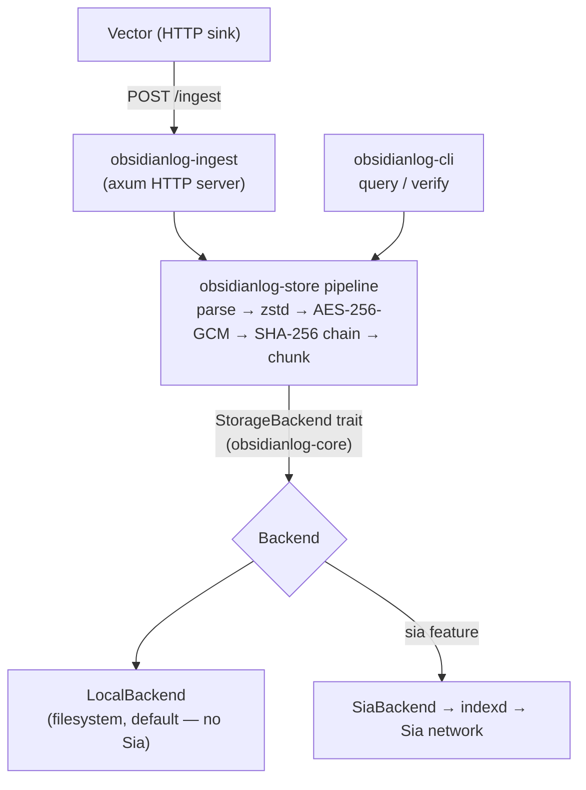

# ObsidianLog

[](https://github.com/emmaglorypraise/ObsidianLog/actions/workflows/ci.yml)

> Long-term, tamper-evident operational log archival on [Sia](https://sia.tech) — client-side encrypted, zstd-compressed, hash-chained, and queryable.

ObsidianLog sits alongside your hot observability stack (Datadog, Grafana, ELK) as a **cold-tier destination**. Logs flow into your active tools for monitoring, then archive to Sia: encrypted before they leave your infrastructure, compressed, hash-chained for tamper-evidence, and queryable at a fraction of the cost — with the keys and contracts owned entirely by you.

> **Status:** early scaffold. The CLI surface, config, and module layout are in place; the core pipeline (compression, encryption, chunking, hash chaining, ingest, query, verify) is stubbed with `todo!()` and `TODO(impl)` markers. Not yet functional.

## Install

```sh
cargo install obsidianlog-cli
```

> The crate is `obsidianlog-cli`; it installs a binary named `obsidianlog`.

> Prebuilt binaries for Linux, macOS, and Windows (including ARM variants) are planned — see the [roadmap](#roadmap). Until then, install from source with the command above.

## Usage

```sh
# One-time interactive setup: generate keys, configure indexd, write config
obsidianlog init

# Run the Vector-compatible HTTP ingest server (point Vector's http sink here)
obsidianlog ingest --bind 127.0.0.1:7080

# Query archived logs
obsidianlog query --service api --level error --since 2026-06-01T00:00:00Z --format json

# Verify the hash chain end-to-end
obsidianlog verify
```

Point Vector at the ingest endpoint with a single sink block:

```toml
[sinks.obsidian]
type = "http"
inputs = ["your_source"]
uri = "http://localhost:7080/ingest"
encoding.codec = "json"
batch.timeout_secs = 300
batch.max_bytes = 10485760
```

## How it works

Each log batch passes through a deterministic pipeline before it touches Sia:
**parse → zstd compress → AES-256-GCM encrypt → SHA-256 hash-chain → chunk**.
A lightweight metadata index (under 1% of log size) is queried first, so full
chunks are fetched and decrypted only when they actually match. Storage and
retrieval are coordinated through [indexd](https://sia.tech).

## Architecture

Logs flow from Vector into the ingest server, through the deterministic storage
pipeline, and out to a pluggable backend. The CLI reads back through the same
backend, hitting the metadata index before fetching chunks. The `StorageBackend`
trait (in `obsidianlog-core`) is the seam that keeps the Sia integration optional.



- **Client / ingestion:** Vector posts JSON log batches to `obsidianlog-ingest`
  (HTTP); the `obsidianlog` CLI drives `query`/`verify` directly.
- **Processing:** `obsidianlog-store` runs the pipeline and owns the crypto.
- **Storage:** the `StorageBackend` trait abstracts durable storage —
  `LocalBackend` (default, no network) or `SiaBackend` (the `sia` feature) via
  the user's `indexd` on the Sia network.
- **Keys/secrets:** generated locally, stored in the OS keychain or a `0600`
  file — never transmitted, never committed.

## Repository layout

This is a Cargo workspace of four crates:

| Crate | Path | Role |
| --- | --- | --- |
| [`obsidianlog-core`](crates/obsidianlog-core) | foundation library | shared types, the canonical error, and the `StorageBackend` trait — no I/O |
| [`obsidianlog-store`](crates/obsidianlog-store) | core library | compression, encryption, hash chaining, chunking, metadata index, and the backend impls (`LocalBackend`, plus `SiaBackend` behind the `sia` feature) |
| [`obsidianlog-ingest`](crates/obsidianlog-ingest) | service library | Vector-compatible HTTP ingest server that drives the storage pipeline |
| [`obsidianlog-cli`](crates/obsidianlog-cli) | CLI / binary | the `obsidianlog` binary: `init`, `ingest`, `query`, `verify` |

The `StorageBackend` trait lives in `obsidianlog-core`, apart from every
implementation, so the pure pipeline never depends on the Sia SDK. The real Sia
integration is confined to one `sia`-feature-gated backend (see
[`docs/adr`](docs/adr)).

## Development

```sh
cargo build --workspace          # build everything
cargo test  --workspace          # run unit + integration tests
cargo clippy --workspace --all-targets -- -D warnings
cargo fmt --all -- --check
```

A containerized quickstart (indexd + ObsidianLog) lives in
[`docker/`](docker/docker-compose.yml). See [CONTRIBUTING.md](CONTRIBUTING.md)
for the full workflow and [SECURITY.md](SECURITY.md) to report vulnerabilities.

### Developing without Sia

ObsidianLog is **mock-first**: the project builds and tests fully against a
local backend with **no Sia node required**. The default `LocalBackend` writes
chunks, indexes, and manifests to a local directory using the same layout as the
on-Sia store, so the entire pipeline — compression, encryption, hash chaining,
ingest, query, verify — can be developed and exercised offline.

```sh
cargo build --workspace          # no Sia, no indexd, no network
cargo test  --workspace          # runs against LocalBackend
```

The real Sia integration lives behind the `sia` cargo feature and the single
`SiaBackend` impl; it is the only place the pre-1.0 `sia_storage` SDK appears.
Default builds and CI never enable it, so day-to-day development stays fast and
dependency-light:

```sh
cargo build -p obsidianlog-store --features sia   # opt in to the Sia backend
```

## Roadmap

- **Month 1** — core storage library + HTTP ingest server
- **Month 2** — query tooling, `obsidianlog init` wizard, cross-platform binaries
- **Month 3** — reusable GitHub Actions workflow, docs site, live demo

## License

[MIT](LICENSE) © Glory Praise Emmanuel. The open-source core will remain MIT-licensed permanently.
